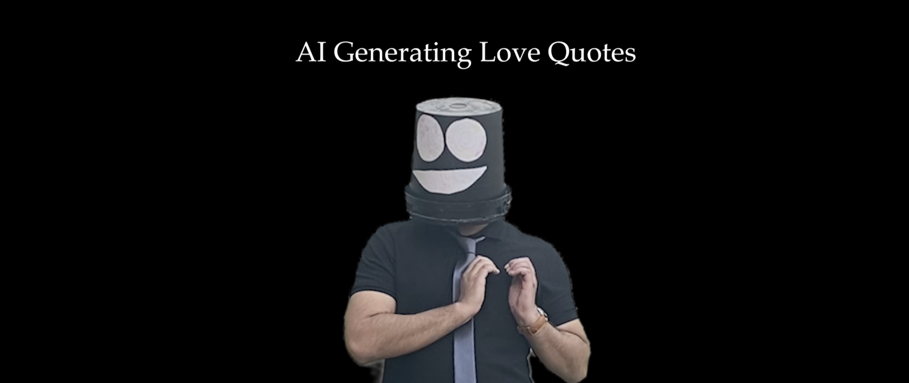
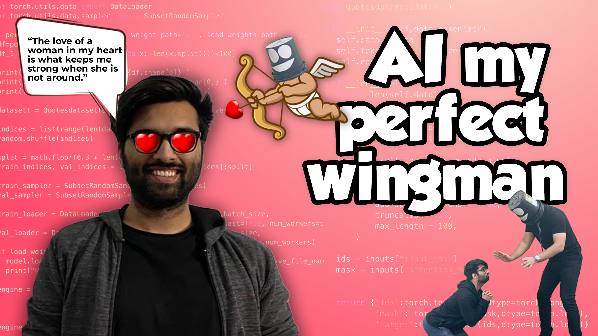

# Your Friendly Wingman - AI Generates Love Quotes
 

  

  

  
  

  

# About

Trained a GPT-2 model on a custom dataset to generate love quotes. Utilized a dataset "[Quotes 500k](https://github.com/ShivaliGoel/Quotes-500K)" where quotes related to love were clustered and used as our training dataset. Trained GPT-2 model's inference time is optimized by 4x times by using ONNX Runtime and then quantised from FP32 to Int8 format, reducing the model size by 3x times without compromising much in the model accuracy/performance.

Git and GitLFS were used for model and code versioning. The resultant model is then served as a web api with Flask and deployed to heroku.

To use this app, [Click here](https://your-friendly-wingman.herokuapp.com/) 

or
 

Visit : https://your-friendly-wingman.herokuapp.com

Few of the AI generated quotes are given below:

## Love Quotes:
* “The love of a woman in my heart is what keeps me strong when she is not around.”
* “Sometimes you just want to be loved and you just want to be loved and then you have to fight for your love.”
* “I do not know if i could be in love with someone as beautiful as you”
* “Love is the highest power in the universe”
* “I have had the pleasure of seeing you, and i am glad to have you back.”

## Sometimes, our AI turns out to be a great motivator:
* “If you’re feeling hurt, give yourself time to heal.”
* “Do not let yourself be discouraged.”
* “I am the light of my life. i am the light that always shines brightly”
* “It is as simple as that : when you say you are sorry, no matter what your response is, you feel it. when you say you are happy, no matter what you say, you are living a beautiful life.”

## Sometimes, it turns out to be depressing:
* “Love is like a dream. it is like a dream that can never be fulfilled.”
* “I love you so much i am afraid i will never see you again.”
* “Sometimes we get what we need. sometimes it comes too late. “

## Sometimes, it’s just eh idk:
* “If you never really loved anyone, you were never likely to get along well. you were a pretty fucking pathetic little ass to me because you were the only one who really had the heart to live up to your own ridiculous expectations.”
* “I would rather die than live in a world where i am a prisoner of the law.”
* “I do not want to live in a society with someone who is not happy with the way i am”
* “I have known someone who is not as good as i am, but i am willing to pay.”

# Flowchart

# Inspiration

So, Valentine day was near and after posting the last video "[AI shuts my GF mouth](https://youtu.be/pj2dLtB8C_4)", it was very important to impress my girl. But I'm not that good with romance or love lines. I seek out my friends but they are as noob as I was. So, I thought of developing an AI that can generate unique love quotes for me that I can share with my girl. 

# Youtube Videos

 I've made some youtube video (devlogs) to show my journey, explained in a sarcastic and informative way via my storytelling skills. Feel free to checkout:

## AI generates Love Quotes - Part 1 (From R&D to training journey)
 

## AI generates Love Quotes - Part 2 (From model optimization to deployment)
 

# Deployment
Used Heroku for the deployment. Feel free to visit https://your-friendly-wingman.herokuapp.com to experience the Web application

## Support

💙 If you like this project, give it a ⭐ and share it with friends!

  

# License
This project is licensed under the MIT License - see the [LICENSE](https://github.com/RsTaK/Your-Friendly-Wingman/blob/master/LICENSE) file for details.
